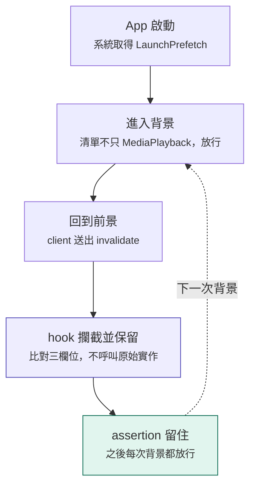
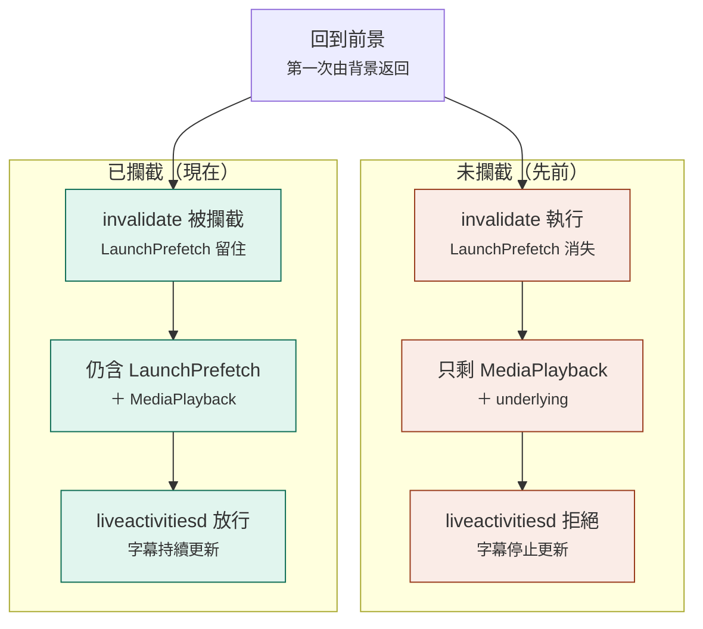

# Caption Island

Caption Island 是可注入 uYouEnhanced／YouTube 的 Theos tweak。它使用原生
ActivityKit Live Activity，把目前字幕顯示在支援機型的系統 Dynamic Island，
並同時提供鎖定畫面版面。

## 字幕來源

預設依序選擇：

1. LRCLIB `syncedLyrics`，依歌曲名稱、歌手與影片長度選擇時間最接近的版本。
2. LRCLIB `plainLyrics`，優先使用現有人工 CC／ASR cue 對齊，否則依影片長度估算。
3. 使用者偏好語言的原始人工 CC（`zh-Hant`、`en` 或 `ja`）。
4. YouTube 原始 ASR 自動字幕。
5. 全部沒有結果時，以 YouTube 內建 HUD 顯示「沒有相符的結果」。

設定也可改成「YouTube 內建字幕優先」，順序會變為人工 CC、YouTube ASR、
LRCLIB 同步／純文字歌詞。字幕軌若晚於影片 metadata 抵達，Coordinator 也會依目前
優先順序重新判斷，不會讓先完成的低優先來源永久蓋過後來抵達的高優先來源。

### 來源標籤

字幕右上角的標籤說明這一句的**時間是從哪裡來的**，定義在 `CICaptionSourceLabel`：

| 標籤 | 來源 | 時間來自 | 時間可靠度 |
| --- | --- | --- | --- |
| `LRCLIB` | `syncedLyrics` | LRCLIB 資料庫的 LRC 時間碼 | 最高 |
| `LRCLIB·ALIGN` | `plainLyrics` + 對齊 | 歌詞文字用 LRCLIB 的，**時間借用 YouTube 現有 CC／ASR 的斷句** | 高（時間是真實量測的） |
| `LRCLIB·EST` | `plainLyrics` + 估算 | 找不到任何可借的時間軸，**把歌詞平均分攤到影片長度** | 低，通常會逐漸偏移 |
| `CC` | YouTube 人工字幕 | YouTube 上稿的時間 | 高 |
| `ASR` | YouTube 自動語音辨識 | YouTube 辨識的時間 | 中 |

`EST` 是唯一「時間是猜的」的模式：它只在歌詞庫沒有時間碼、而且該影片也沒有任何可用
字幕軌時才出現。看到它就代表對不準是預期行為，不是 bug——可用目前影片的專屬設定調整
字幕提前秒數，或改用其他來源。

三種 LRCLIB 標籤一律顯示，`CC` 與 `ASR` 只有在開啟「顯示來源標記」時才顯示，因此
LRCLIB 的標籤在畫面上出現得比較頻繁。

含 `tlang` 的字幕 URL 會被拒絕，因此不會把 YouTube 自動翻譯誤認成人工字幕。
支援的字幕 payload 包含 YouTube JSON3、WebVTT、timedtext XML／SRV3，以及
LRCLIB 標準 LRC 時間碼。

若播放器回報 `isPlayingAd`，或目前 `YTSingleVideo.videoType` 為廣告／內容插播，
Caption Island 不會建立影片 context 或發出 LRCLIB／字幕請求。廣告在既有查詢期間
開始時會取消該工作，等內容影片恢復後才重新載入。

## Live Activity

主 tweak 取得影片與播放時間，ActivityKit bridge 更新同一張 Live Activity；
Widget extension 負責 Dynamic Island 的 compact、minimal、expanded 版面與鎖定畫面。
expanded 與鎖定畫面會同時顯示目前句和字體較小的下一句；清醒狀態換句時使用
push／淡入淡出過渡。換片時會沿用現有 Activity，避免反覆收合與展開。只有字幕 cue
改變時才送出更新。

本 Tweak 最低需要 iOS 17.5。沒有 Dynamic Island 的裝置仍可在鎖定畫面看到
Live Activity。進入 PiP、背景或鎖定畫面時，仍會優先接受 YouTube 的原生播放時間
callback，並另外以每 0.75 秒一次的低頻計時器作 fallback；兩條路徑最後都由
Coordinator 去重，只有字幕 cue 改變時才更新 Activity。進入背景前會短暫保留目前
播放器，避免 PiP 切換視圖時釋放時間來源；回到 App 完全 active 後才停止 fallback
並釋放引用。AVKit、YouTube 現代與舊版 PiP 啟動入口也會直接觸發同一套準備流程，
避免只靠 `viewDidDisappear` 而錯過自動 PiP。

YouTube 在第二次前景／背景切換後，有時音訊仍播放但私有的 media-time getter 停在
舊值。背景監控器此時會以系統 Now Playing 的 playback rate 延續已確認的時間錨點，
不會只因 getter 三秒未變就誤判為暫停；YouTube rate callback 或 Now Playing 明確
回報 rate 為零時，才會停止換句排程。播放器每次回到前景畫面也會重新綁定監控器，
避免下一次鎖屏仍持有第一輪的播放器 graph。

背景同步也會在 YouTube 已提供的 Now Playing dictionary 上補正 elapsed time、
duration 與 playback rate，不取代標題、封面或 Remote Command，因此鎖定畫面的時間
可由系統持續推進，播放控制仍由 YouTube 處理。

此機制需要 YouTube 的背景音訊仍在播放，讓 App 保有系統核准的背景執行時間。若
使用者從多工畫面關閉 YouTube 時，`UISceneDidDisconnectNotification` 會略過排隊中
的歌詞更新並立即要求 ActivityKit 移除所有 Caption Island Activity；
`UIApplicationWillTerminateNotification` 則作為第二層清理。若 iOS 在沒有 scene
callback 的極端狀況直接終止程序，要讓程序外部仍能可靠結束 Activity，仍需要額外的
ActivityKit push server。本 Tweak 不會播放無聲音訊來規避系統限制。

「螢幕關閉」時面板本身不會發光：iPhone 11 會在喚醒鎖定畫面時看到最新字幕；
支援 Always-On Display 的機型則仍由 iOS 的 AOD 顯示規則決定刷新頻率。iOS 會節流
類似逐句歌詞的本機 Live Activity 更新，而且 AOD 不播放 WidgetKit 動畫；因此本
Tweak 會一次提供目前句與下一句，讓被節流時至少仍看得到下一句預告。ActivityKit 的
`staleDate` 只能標記內容過期，不能在指定時間替 Widget 切換字幕；若 YouTube 程序被
暫停，仍不能保證 AOD 長時間逐句即時重畫。本版本只使用 App 內的本機 ActivityKit
更新，不含 APNs Live Activity push 或外部 relay。

expanded Dynamic Island 會依目前句與下一句的實際高度擴張，並使用三階段
`ViewThatFits`：一般內容顯示影片標題，長歌詞優先隱藏標題，極長歌詞再縮小字級與
行數，避免最底部被系統上限裁切。leading／trailing／bottom region 都保留額外安全
邊距，避免字幕 icon 貼近圓角或 TrueDepth 區域。

版面預算以 `layoutWidth()` 計算，**全形字元算兩個單位**。這些門檻原本是照拉丁文字調的，
直接用 `String.count` 會把日文、中文、韓文歌詞低估將近一半：實測案例
「何も残らない 残りはしない」只有 13 個字元，被判定為「還放得下影片標題」，但它實際換行
成兩列，把標題整個推到島外裁掉。改為加權後同一句是 25 單位、與下一句合計 56 單位，超過
48 的門檻而正確進入「隱藏標題」那一階，這是原本就設計好的降級路徑。拉丁文字的加權值與
字元數相同，因此行為不變。

## 背景更新為何會停止

背景字幕會停止更新，根本原因不在本 Tweak，而在 `liveactivitiesd` 的一道檢查。
被拒絕時系統會記錄：

```text
Process is only playing background media so is forbidden to update activity: <pid>
```

實測（多份 log、數十次拒絕，無例外）確立的規則是——`liveactivitiesd` 查詢
RunningBoard 取得該 **process** 目前持有的 assertion 清單，若清單裡「只有」
`com.apple.mediaexperience:MediaPlayback`（加上人人都有的
`com.apple.underlying:defaultUnderlyingAppAssertion`），就拒絕本機 ActivityKit
寫入；只要多出任何一項其他 assertion 就放行。錯誤訊息中的 pid 即說明這是跨程序的
process 層級判斷。

觀測到能讓判斷通過的 assertion，以及它們何時消失：

| assertion | 來源 | 消失時機 |
| --- | --- | --- |
| `pagein-prefetching:LaunchPrefetch` | iOS 啟動期 page-in 量測 | App **第一次從背景回到前景**的瞬間（3/3 樣本吻合），並非計時器。**釋放由程序內的 client 發起，已被攔截**——見下節 |
| `sessionkitd:DeliverEvent` | Live Activity 事件投遞 | 數秒內自行消失；也可能是更新成功的副產物而非原因 |
| `mediaremote:Command` | 使用者實際操作鎖定畫面／控制中心的傳輸控制 | 停手後數秒 |
| `pictureinpicture:PIPVisible` | PiP 啟動 | 僅在啟動瞬間出現，無法持續持有 |

這四項都是系統為了與字幕無關的理由授予的，沒有公開 API 可以申請或延長。

`LaunchPrefetch` 原本的行為是：一旦回到 App 一次，該次 App session 即失去資格，之後不論
換第幾部影片或是否使用 PiP 都無法恢復，必須強制關閉 YouTube 再重新開啟才會重置。**這個
限制現在已由預設啟用的保留機制解除**，見下節。

### LaunchPrefetch assertion 保留

**這是預設啟用的核心行為，沒有對應的設定開關。** 沒有它，使用者第一次回到 YouTube 之後
背景字幕就會在該次 App session 內永久失效——那不是一個值得留給使用者自己決定的選項。
2026-08-05 實測成立：hook 攔到了釋放，assertion 保住，且 `liveactivitiesd` 不再拒絕。

```text
02:54:23  取得 LaunchPrefetch（fresh launch, pid 20583）
02:54:26  Entered background cycle 1                        LaunchPrefetch 在
02:54:51  Intercepted client invalidation … retained count=2 ← hook 攔到
02:54:51  Returned to the foreground                        LaunchPrefetch 仍在 ★
02:54:57  Entered background cycle 2                        仍在
02:55:14  Returned to the foreground（第二次）                仍在
02:55:17  Entered background cycle 3                        仍在
02:55:27  Background sample at 63.6s                        仍在
```

`02:54:51` 回前景那一行是關鍵：在此之前的每一份 log，LaunchPrefetch 都在第一次回前景
的瞬間消失，cycle 2 隨即在 1～3 秒內被拒。這次跨越兩次回前景、三個背景週期、63 秒都
還在，且全程沒有出現 `A caption revision was refused`——該行與其他 `Eligibility` 行
同分類同篩選條件，所以它的缺席是真的沒發生，而非被過濾。

由此也確定了先前懸而未決的問題：**釋放由程序內的 client 發起，不是 RunningBoard
server 撤銷**，因此程序內 hook 攔得住。實際攔到的是 `-[RBSAssertion invalidate]` 這條
fallback；解鎖點是修掉 `oneway void`（`Vv16@0:8`）的簽章誤判，在那之前 fallback 根本
沒有裝上。

尚未驗證：**長時間**（目前樣本僅 63 秒，RunningBoard 可能有更長的容忍上限）與
**螢幕關閉的實際情境**（目前測的是回主畫面）。

### 保留 assertion 的代價

**曝險上限是一個 App session，不是無限期。** 這張 assertion 的 target 是本程序自己的
pid，而 RunningBoard 的 assertion 綁在 client 連線上——程序結束、連線斷開，
`runningboardd` 就會回收。從多工畫面滑掉會終止程序，所以 assertion 必然消失，不需要
任何程式介入。`sceneDidDisconnect:` 與 `applicationWillTerminate:` 兩個 handler 仍會
主動釋放，用於「scene 斷開但程序還活著」的情況。

也**不能提前釋放**：實測三個樣本（pid 20063、20426、20583）顯示 `app_launch_measurement`
在每個程序生命週期只取得一次，所以放掉就沒有第二次機會，只能重開 App。原本考慮「播放
停止就釋放」以縮小曝險，但那會讓後續影片完全失去背景字幕能力。

真正的成本不在 assertion，而在**它解鎖的行為**：每 2～5 秒一次 ActivityKit 更新，
就是一趟 IPC 加上另一個程序（`chrono.WidgetRenderer-Activities`）重繪 widget。這是功能
本身的代價。

另一個成本則是可以消除的，也已經處理：如果程序因為持有這張 assertion 而無法進入暫停，
那道「暫停會凍結 dispatch timer」的天然保護就消失了。因此

- 播放被確認暫停超過 `CIBackgroundPausedTimerStopDelay`（15 秒）後會停止背景時鐘。
  先前只有播放器被釋放才會停，所以一部停在結尾的影片會讓 0.75 秒計時器一直觸發——
  在程序會被暫停的年代看不出來，現在會是實際耗電。恢復播放時 rate callback 會重啟它。
- `Eligibility` 快照改為只在「詳細記錄」開啟時才取樣。每一次快照都要 dlopen
  RunningBoardServices、以 KVC 走訪、再對一大段 description 跑 regex，這在使用者整場
  聆聽期間每 2.5 秒重複一次太重；而這份資料只在調查拒絕時才會被讀，那時本來就得開記錄。

做完這兩項之後，即使程序真的無法暫停，代價也只剩記憶體常駐，沒有持續的 CPU 工作。

#### 保留機制流程



#### 回到前景時的兩條路徑

分歧點只有一個：`-[RBSAssertion invalidate]` 有沒有被攔下來。



它不建立或偽造 assertion；主要攔截 `alm_release_pageins_recording_assertion`，讓
Apple 的 app-launch measurement library 繼續持有原本的物件。
`-[RBSAssertion invalidate]` 是第二層 fallback，只有 assertion 同時符合以下條件才保留：
explanation 來自 `app_launch_measurement` 的 page-in recording、attribute 是
`pagein-prefetching:LaunchPrefetch`，且 target 是目前 bundle ID 或 pid（包括 iOS 26
使用的純數字 PID 表示）。fallback 最多保留 4 個；停用開關、App 終止或最後一個 scene
關閉時，會透過原始實作正常失效。

**hook 每次啟動都會安裝**，因此程序內每一次 `RBSAssertion` 失效（音訊、PiP、背景任務、
extension）都會經過比對函式。為此比對加了一道便宜的前置否決：先只看 `explanation` 這個
純字串屬性有沒有 `app_launch_measurement`，不符就立刻返回，不去格式化
`[descriptor description]`（那是整個比對裡最貴的一步）。`explanation` 不存在或不是字串時
會落回完整比對而不是否決，所以這只會省工，不會漏掉該攔的 assertion。

沒有偏好設定要讀，也就不會有「舊版把開關關掉的使用者，升級後靜默失去背景字幕」這種情況。

安裝 `-[RBSAssertion invalidate]` 之前會先用 `method_copyReturnType` 與
`method_getNumberOfArguments` 確認它真的是 `void (id, SEL)`，不符就拒絕安裝並記錄實際
的 type encoding。這不是對私有 API 漂移的過度防範：`method_setImplementation` 會改掉
程序內**所有** `RBSAssertion` 的該方法，若真實方法有回傳值而替換函式沒有寫回傳暫存器，
每一個與本實驗無關的呼叫端都會讀到殘留的垃圾值。

比對前必須先跳過型別修飾詞。iOS 26 實測該方法的 encoding 是 `Vv16@0:8`——宣告為
`oneway void`，`method_copyReturnType` 因此回傳 `"Vv"` 而不是 `"v"`。`oneway` 只影響
distributed object 的遠端訊息傳遞，本地呼叫慣例與 `void` 相同，所以替換是 ABI 安全的；
但沒有跳過 `V` 的比對會把它誤判成不相容而拒絕安裝（第一版就是這樣誤報的）。可能出現的
修飾詞為 `r n N o O R V`。

`alm_release_pageins_recording_assertion` 是 C 符號、執行期沒有型別資訊，`void (void)`
只能從名稱推斷而無法驗證；它的影響範圍小得多（呼叫端只在 Apple 那個函式庫內），但若
未來 iOS 給它參數或回傳值，問題會從那裡開始。該符號改以 `dlsym(RTLD_DEFAULT, …)` 在全
程序範圍搜尋，並用 `dladdr` 回報實際所在的 image；先前硬寫死
`/usr/lib/libapp_launch_measurement.dylib` 在 iOS 26 上得到 `directReleaseHook=no`，而
路徑寫錯與符號不存在在 log 中完全無法區分。若仍找不到，會列出名稱含 `measurement` 的
已載入 image 供下一步追查。

判讀方式：啟動 Log 應出現 `LaunchPrefetch hooks installed=yes`，並可從
`directReleaseHook` 與 `rbsFallback` 兩個欄位看出實際裝上哪一條。之後應出現
`Intercepted app_launch_measurement release directly`；若直接符號不存在，才會看到
fallback 的 `Intercepted client invalidation`。接著應在 `Eligibility` 快照看到
`pagein-prefetching:LaunchPrefetch`。三種結果各自的意義：

- 有攔截紀錄但 assertion 隨後仍消失 → RunningBoard server 主動撤銷，client-side hook
  無法阻止，這條路可以整個否決。
- assertion 保住但 `liveactivitiesd` 依舊拒絕 → 直接否決「只要保留 LaunchPrefetch
  就足夠」的假說。
- assertion 保住且不再被拒 → 成立。

判讀 log 時有一個陷阱：**「沒有出現拒絕」不等於「有資格」**。拒絕只在實際發起
更新時才會產生，而字幕僅在 cue 邊界更新，因此兩次換句之間的空白期不能當作有資格
的證據。

### 已實測否決的做法

- `UIApplication beginBackgroundTask`：只能提供有限的收尾時間，不能建立可長期
  續期的字幕服務；在 media-playback-only 狀態下也沒有恢復持續 ActivityKit 更新。
- 以私有 `MRMediaRemoteSendCommand` 送出多餘的 Play 指令換取
  `mediaremote:Command`：41 次送出、0 次產生該 assertion（App 內部呼叫不會走
  mediaremoted 的外部遙控投遞路徑），且會讓使用者暫停的影片自行繼續播放。
- 在 App 內偽造前景狀態：狀態由 FrontBoard／RunningBoard 授予並由
  `liveactivitiesd` 跨程序查詢，hook 自身 `applicationState` 只能騙到本程序的
  程式碼。
- ShazamKit 作為標題搜尋的備援：需要 `com.apple.developer.shazamkit` entitlement
  （必須綁定自有 App ID），且需麥克風權限——戴耳機時無法辨識播放中的音樂。

### Apple 的正式立場

開發者論壇 thread 776031，Apple Frameworks Engineer 回覆：背景更新 Live Activity
**只支援透過推播通知**。要以受支援的方式突破，必須改用 APNs Live Activity push；而推播
憑證必須綁定自有 Team ID 與 App ID，因此需要先以自己擁有的 bundle ID 重新簽署整個 App
與所有 `.appex`。

先前基於 `BGContinuedProcessingTaskRequest` 的實驗（iOS 26 持續背景字幕）以及把歌詞寫入
Now Playing 標題的實驗都已移除：前者的註冊在實測中從未被系統授權，後者會覆寫 YouTube 的
媒體資訊且效果不明。LaunchPrefetch 保留機制已實測成立，兩者都不再需要。

### 診斷工具

`CIProcessDiagnostics` 會在進入背景、回到前景，以及背景期間每 5 秒，記錄一筆
`Eligibility` 分類的快照，內容包含 `UIApplication.backgroundTimeRemaining` 與
RunningBoard 對本 process 的 `taskState`、`tags` 與 assertion 清單。要比對「可正常
更新」與「被拒絕」兩種週期的差異，直接看這個分類即可。assertion 清單是從
`RBSProcessState` 的 description 以字串解析取得——該欄位可由 KVC 讀到但回傳型別
並非 `NSArray`，而 description 是 RunningBoard 唯一保證的表示形式。

`Activity.update(_:)` 不會 throw，被 `liveactivitiesd` 拒絕時完全沒有回饋，因此
bridge 會在下一次送出前回讀 ActivityKit 實際儲存的 revision，記錄
`Caption reached the Live Activity` 或 `did not accept revision`。驗證刻意延後到
下一個 cue 才做：緊接在 `update(_:)` 之後回讀會與 daemon 的往返競爭而誤報拒絕；
相隔不到 0.4 秒的連續更新則直接略過驗證，寧可少一筆資料也不記錄不可信的結論。

## 設定

安裝後前往「YouTube 設定 → Tweaks → Caption Island」：

- 啟用或停用原生 Live Activity；
- 選擇返回主畫面時使用 YouPiP 自動子母畫面，或使用 Caption Island 背景
  字幕模式；背景字幕模式只阻止自動 PiP，播放器內的手動 PiP 按鈕仍可使用；
- 選擇中文（繁體）、英文或日文人工字幕；
- 選擇 LRCLIB 優先或 YouTube 內建字幕優先；
- 啟用或停用 LRCLIB 查詢；
- 在「已儲存的歌詞」查看已快取首數、查無歌詞筆數與占用空間，並匯出／匯入／清除；
- 為目前影片指定 LRCLIB 搜尋歌名、歌手與字幕提前／延後秒數（正值代表提早，
  範圍為 -30～+30 秒）；設定以 YouTube video ID 個別保存；
- 選擇是否顯示 `CC`／`ASR` 來源標記；LRCLIB 來源固定標示；
- 開啟詳細 Log；
- 進入 Log 預覽，篩選全部／警告／錯誤、分享或清除記錄。

Caption Island 背景字幕模式不會清除 YouTube 的 Now Playing 資料，避免破壞控制
中心與鎖定畫面的播放控制。因此，若 iOS 同時顯示系統 Now Playing Live Activity，
Dynamic Island 仍可能依系統規則把兩張活動縮成 minimal；這個模式只負責可靠地
阻止返回主畫面時自動建立 PiP 浮窗。

手動 PiP 被叉叉關閉時，AVKit 會釋放該 PiP 的 sample-buffer renderer。若使用者
之後從控制中心按播放，Caption Island 會先保存的影片 ID／時間重建 YouTube
背景播放器，再 seek 回原位置；不會把 Play 送回已失效的 PiP renderer。重建後會
觀察播放時鐘 12 秒，時鐘停滯時最多自動重建一次；兩次都失敗時會保留影片與時間，
讓下一次明確的控制中心 Play 再開啟一輪恢復，而不是回到已失效的 renderer。舊 PiP
延遲送到的 teardown pause 在恢復期間會被忽略。回到 App 再次手動觸發 PiP 時，會先
把目前影片重新綁定至 PiP 控制器；影片切換或 PiP 返回 YouTube 則會取消舊恢復，避免
操作到錯誤的影片。

## Log 與隱私

Log 使用一條 serial queue 維護最多 500 筆記錄，並寫入：

```text
Library/Caches/CaptionIsland/CaptionIsland.log
```

檔案上限為 128 KB，超過時只保留最新內容。Info、Warning 與 Error 固定記錄；
Debug 只有在「詳細記錄」開啟時才會加入。預覽頁會在新事件出現時即時更新。

Log 僅供診斷來源選擇、下載與 ActivityKit 狀態；不保存完整歌詞、字幕 URL、
Cookie、API key 或 Authorization 內容，且會在寫入前再次遮蔽這些資料。
背景期間每 30 秒會記錄低頻 clock heartbeat，並分別記錄 YouTube 原生 callback、
Live Activity revision 與 Now Playing 同步是否仍在工作，方便區分 App 已被暫停與
ActivityKit 只延後 AOD 畫面刷新。
PiP 關閉後的控制中心恢復會另外使用 `PlayerGraph` 分類，依序記錄
`Armed`、`Intercepted`、`Rebuilding`、播放時鐘開始前進及 12 秒健康檢查結果。

## LRCLIB 匹配

標題解析器會先辨識 `「歌名」`／`『歌名』`、`歌手 / 歌名`、`歌名 / 虛擬歌手 SV`
及常見的 artist-title 分隔，並移除 Official Video、動畫作品說明、音訊優化等
上傳資訊；未知的中括號不會任意刪除，因此 `SawanoHiroyuki[nZk]` 仍可保留。
一般上傳者頻道不會被當作歌手，只有標題內可辨識的歌手或
Topic／VEVO／Official Artist Channel 才會加入歌手條件。無法可靠推導時會只查
歌名，使用者可用目前影片的專屬設定消除同名歌曲歧義。

每一次自動查詢都走 LRCLIB `GET /api/search` 並**只送 `track_name`**，永遠不再使用
`GET /api/get`。`/api/get` 把歌名、歌手、長度當成單一 AND 條件比對，而從上傳標題推導
出的「歌手」經常根本不是演出者——`Street Fighter 6 Ingrid's Theme` 是遊戲場景名、
`ウォルピスカーター MV` 帶了多餘後綴、`HoneyWorks feat.ハコニワリリィ` 與 LRCLIB 的
正式署名不同——只要有一項不符就直接得到 404。這是「標題明明正確卻找不到歌詞」的
主要原因。改以歌名搜尋後，歌手降級為排序訊號，這是一個猜測值唯一能安全擔任的角色。

同一份回應會被評分兩次，因此放寬搜尋不需要額外的網路請求：

1. **嚴格通道**保留歌手作為排序訊號，讓署名確實相符的候選勝出；
2. **寬鬆通道**完全丟棄歌手，只用歌名與長度判定。

第二層是必要的：歌手猜錯時它在第一層只可能壓掉正確曲目。歧義否決在兩層都會執行，
所以在沒有長度可判斷時仍然會放棄而不是亂猜。

候選篩選門檻依歌手是否被資料佐證而定：若有任何候選的歌手相似度達標，則歌手可信，
沿用歌名與歌手的合併分數作為門檻；若完全沒有候選對得上，則判定歌手為誤推，改為
只以歌名分數篩選，避免把正確曲目連帶剔除。判定為未佐證時，歧義比較也一併改用歌名
分數——否則剛剛才被認定不可靠的歌手相似度會在下一步把兩個候選拉開，把真正的歧義
誤判成「已解決」。
唯一的例外是正規化後長度極短（5 字元以內）的歌名——這類通常是常見單字，資訊量不足
以單獨判定，在嚴格通道仍要求基本的歌手相符，再由寬鬆通道接手。

**多個演出者共用同一個歌名不算歧義。** 翻唱與重新上傳的歌詞內容相同，所以即使挑到
另一個演出者，顯示的歌詞通常仍然正確；把「歌手不同」當成放棄的理由，是在防一個大多
不存在的問題，代價是翻唱眾多的熱門歌永遠拿不到歌詞。真正會出錯的是**同名但不同曲**，
而那種情況靠長度就分得開。因此只要取得到影片長度就交給長度決定（排序的第一鍵就是
長度差），長度相同時由有無時間軸決定。只有在完全沒有影片長度可用時才放棄——那時沒有
任何判斷依據，同名不同曲也無法察覺。

以分隔符組成的標題無法從字面判斷哪一側是歌名：`AiNA THE END / On The Way` 是歌手在
前，`風になる / Nachoneko` 是歌名在前，`Street Fighter 6 Ingrid's Theme - Cosmic
Scale Pretty` 兩側都不是歌手。解析器必須先選一種讀法，因此當那個讀法查不到任何結果
時，會**以另一側作為歌名再搜尋一次**，並把原本的歌名降級成歌手提示。只有在所有讀法
都查不到之後才會寫入負向快取，否則第一個猜測會被鎖定 12 小時。

### 一個標題的多種讀法

上傳標題沒有語法可循，單一次解析只能猜。所以查詢時不再只送一種讀法，而是產生一份
**候選讀法清單**，依序搜尋，並由影片長度決定哪個猜對了。清單最多 4 個讀法
（`CISongQueryMaximumCandidates`），順序為：

| 順序 | 來源 | 說明 |
|---|---|---|
| 1 | `parsed` | `CISplitSongMetadata` 選定的讀法，與改動前完全相同 |
| 2 | `dash-right` | 破折號右側；`歌手 - 歌名` 是較常見的形狀 |
| 3 | `dash-left` | 破折號左側 |
| 4 | `bracket` | `「」`、`『』` 內的每一段 |

破折號的兩側各自把另一側當作歌手提示——猜對時那正好是真正的歌手，是有效的排序訊號。
半形 `-` 必須兩側有空白才算分隔，所以 `Re-Bell`、`K-POP`、`lo-fi` 不會被切開；`–`／`—`
不需空白但不會切在數字之間，所以 `2019—2020` 是區間而不是分隔。

每一側都會先截到第一個括號為止再清理裝飾字串，因為那個位置之後是上傳說明而不是歌名。
以實例說明：

```
封茗囧菌x雙笙 - 世末歌者「那怕只 一瞬的 奇蹟。」 [ High Quality Lyrics ][ Chinese Style ] tk推薦 益笙菌
  → parsed      "那怕只 一瞬的 奇蹟。"   （「」抽取，改動前唯一會查的讀法）
  → dash-right  "世末歌者"              歌手提示 "封茗囧菌x雙笙"
  → dash-left   "封茗囧菌x雙笙"          歌手提示 "世末歌者"
```

**`《》` 刻意不作為抽取來源。** 它是中文標示作品名的慣例，但在音樂上傳中那個作品是
歌曲本身的機率，並不明顯高於是動畫、電影或專輯名稱，而標題裡沒有任何線索能可靠區分這
兩者——`竖屏｜《トレセン音頭》花钻Ver` 的括號是歌名，`《鬼滅之刃》主題曲 紅蓮華` 的括號
是作品名，形狀完全相同。既然無法區分，就不值得為它花一個請求。`《` 仍然是破折號側邊的
**截斷點**（它後面是上傳說明而不是歌名），這與把括號內容當歌名是兩件不同的事。

代價是這類標題會把括號一起送出去查：`竖屏｜《トレセン音頭》花钻Ver` 會由 `｜` 切出歌手
`竖屏`、歌名 `《トレセン音頭》花钻Ver`，而後者幾乎一定查不到。這種影片需要用「目前影片的
歌詞設定」手動填入歌名。

**成本控制。** 讀法逐一搜尋，每個請求都經過同一個速率限制器，所以無論標題產生幾個讀法
都不會擴散成連續請求。常見情況仍然只花一個請求：`parsed` 排在最前，而一旦某個讀法找到
**帶時間軸且長度差在 2.5 秒以內**的結果就立刻結束搜尋（`resultIsConclusive:`）。兩個條
件必須同時成立才算定案——只有長度對的純文字歌詞可能被另一個讀法的同步版本擊敗，而長度
不對的同步歌詞正是這整個改動要抓的錯誤。

不夠確定的結果會被留作備案繼續往下搜，最後由長度最接近者勝出；長度差在容許範圍內並列
時，由有無時間軸決定。網路錯誤或冷卻會立刻中止整串搜尋（`abortLookupWithContext:`），
但先前已經取得的備案仍然會回傳而不是丟掉。

結果一律寫在**第一個讀法**的快取鍵下，不管實際是哪個讀法找到的，所以重看同一支影片只
需一次快取讀取，舊版本寫入的項目也仍然定位得到。使用者在「目前影片的歌詞設定」裡自行
輸入的歌名是決定而不是猜測，會單獨搜尋，不會展開成多個讀法。

`CILRCLIBCacheQueryGeneration` 已由 2 提升為 3，因此舊版本記錄的「查無歌詞」會被丟棄
重查；**已經成功存下的歌詞不受影響**。如果某支影片先前是配對到「錯的歌」而不是查無結果，
那筆正向快取不會自動失效，需要手動使用「清除 LRCLIB 查詢快取」。

通過門檻後以影片總時間選擇最接近的版本。LRCLIB 曲目比影片長時只容許約 18～35 秒
差距，避免 90 秒 TV Size 誤配到較長版本；影片比曲目長時則容許約 35～60 秒，保留
MV 劇情片頭／片尾的空間。時間差在 2.5 秒以內視為同一版本並列，此時**優先選擇有
同步歌詞的候選**——LRCLIB 常收錄同一首歌的多筆上傳，長度僅差不到一秒但只有其中
一筆帶時間軸，嚴格照時間差排序會為了 0.3 秒之差而丟掉同步版本。同步時間軸不合理
時，會退回同筆純文字歌詞。

查詢結果會寫入本機快取，所以同一支影片重看不會再發一次請求。**歌詞不會過期**——只有
使用者刪除，或快取超過上限（2000 筆／8 MB）而淘汰最久未寫入的項目時才會消失。淘汰
是依寫入時間，不是依時間到期。舊版本寫入的項目帶有實際到期日，載入時一律視為永久，
不需要遷移，使用者手上的資料不會因為這個改動而消失。

負向記錄（查無歌詞）刻意維持 12 小時。永久記住「這首沒有歌詞」會讓之後才被貢獻到
LRCLIB 的曲目永遠找不到，而 12 小時已足以避免播放期間反覆查詢。

快取檔位於 `Library/Application Support/CaptionIsland/`，不是 `Library/Caches`。
後者是可回收空間，iOS 在儲存空間不足時可以逕行刪除，這與「不會過期」互相矛盾。
舊路徑的檔案會在第一次載入時搬移過來，搬移失敗則刪除舊檔並在下次查詢時重新取得。

設定頁的「管理已儲存的歌詞」提供瀏覽介面：列出每一首的歌名、歌手、長度、有無時間軸
與行數，可搜尋歌名／歌手／專輯，點入可讀取實際存下的歌詞內容（有時間軸時連同時間戳
一起顯示），左滑刪除單筆，或以「刪除符合項目」一次刪掉目前搜尋命中的全部項目——沒有
搜尋條件時該按鈕等同清空，兩種情況的確認訊息會分別說明。刪除後會遞增記憶體世代編號，
讓仍存活的 provider 重新載入，不會從記憶體回傳已刪除的項目。

快取也可匯出成單一 plist 以搬移到其他裝置；匯出只包含確實有歌詞的項目，負向記錄短命
且無遷移價值，不會帶走。匯入時每一筆都會重新走一次與網路回應相同的驗證流程（長度、
數量、時間軸合理性），任何不合格的項目直接略過而不會讓整次匯入失敗；schema 版本不符
或檔案無法解析則會明確回報錯誤。匯入的項目一律以永久保存寫入。

快取檔帶有兩個獨立的版本號，因為兩類項目的失效條件不同。**schema 版本**描述檔案格式，
不符時整份丟棄——匯入也會拒絕不符的檔案。**查詢世代**只標記在負向項目上：查詢構成或
評分規則一旦改動，舊的「查無歌詞」結論就不再代表新邏輯的結果，載入時逐筆丟棄，但已經
成功取得的歌詞完全保留。這個區分是必要的——負向快取會完全跳過網路請求，若不失效，
搜尋邏輯的修正在舊項目過期前都不會生效；而用遞增 schema 版本來達成這件事會連帶讓
使用者匯出的歌詞檔無法匯入。
歌詞內容會保存在裝置上直到使用者刪除。若要公開發行，仍應自行確認歌詞內容的顯示權利。

## 資源使用

- 一條 utility QoS serial queue 管理字幕狀態；
- 同時間最多一個字幕下載與一個 LRCLIB request，換片會取消舊工作；
- YouTube 字幕使用最多 8 筆的記憶體快取；LRCLIB 歌詞寫入磁碟並永久保存；
- 前景與 PiP／背景都保留 YouTube callback（Coordinator 最多接受約 5 Hz）；背景
  另外使用單一 0.75 秒 fallback 計時器並提供 0.15 秒系統容差，時間未改變時不提交
  任何字幕工作；
- Now Playing 的一般校正最多每 12 秒一次，播放／暫停或倍速狀態改變則立即更新，
  之後由 iOS 依 playback rate 自行推進時間；
- 不擷取音訊、不使用 CoreML，也不進行裝置端語音辨識或無聲音訊保活。

## 建置與驗證

### 目錄結構

三個建置產物住在同一棵樹底下，但**必須是三個不同的目錄**：theos 一個目錄的 Makefile
只能產出一個產物，而 tweak（`tweak.mk`）與 App Extension（`appex.mk`）是不同型別。

```
Tweaks/CaptionIsland/
├── *.m *.h *.xm            tweak 本體 → CaptionIsland.dylib
├── Shared/                 tweak 與 widget 共同編譯的 Activity payload 定義
│   └── CICaptionActivityAttributes.swift
├── Assets/CaptionIsland.bundle    在地化字串與資源，由根 Makefile 嵌入
├── Widget/                 → CaptionIslandWidget.appex（動態島與鎖定畫面 UI）
└── Tests/                  Swift Package + ObjC smoke test，不編進成品
```

`Shared/CICaptionActivityAttributes.swift` 同時列在兩邊的 `_FILES` 裡
（`Makefile:34` 與 `Widget/Makefile:13`）——這是 tweak 與 widget 對「Activity 資料
長什麼樣」達成一致的方式，不能只編一邊。

`Widget` 在根 `Makefile` 的 `SUBPROJECTS` 裡是獨立條目
（`Tweaks/CaptionIsland/Widget`）。theos 不會自己遞迴子目錄，所以巢狀只是檔案系統
上的擺放；同樣兩層深的 `Tweaks/FLEXing/libflex` 早已這樣運作。`.appex` 的輸出路徑
由 `Widget/Makefile` 的 `THEOS_OBJ_DIR_NAME = obj/CaptionIslandWidget` 決定，與目錄
位置無關，因此搬動目錄不影響 `CAPTION_ISLAND_WIDGET_APPEX`。

`Tests/` 不在 `SUBPROJECTS`、不在任何 `_FILES`，對 IPA 完全零影響，但 CI 會執行它，
所以刪掉會讓 CI 失敗。

專案由根 Makefile 編譯 tweak、嵌入 `CaptionIsland.bundle`，並封裝
`CaptionIslandWidget.appex`。封裝時也會把
`<主程式 Bundle ID>.captionisland.background-captions.*` 加入主程式的
`BGTaskSchedulerPermittedIdentifiers`；執行時則為每一代產生一個 UUID concrete
identifier，並以該完整值依序 register 與 submit。iOS 26 API 以 runtime availability
檢查，因此最低部署版本與建置 SDK 仍可維持 iOS 17.5。在 Theos、theos-jailed、
iOS SDK 與合法取得的
decrypted YouTube IPA 都已準備好時，可沿用專案原本的建置方式：

```sh
make package THEOS_PACKAGE_SCHEME=rootless IPA=Payload/YouTube.app FINALPACKAGE=1
```

`Scripts/build-local.sh` 可在本機重現 CI 的「Build and Release uYouEnhanced」
流程：帶入一份 decrypted IPA，建置**當前工作樹**（含未提交的改動），跑完整測試與
建置後的 IPA 驗證，輸出到 `build-output/` 並附上分支、commit 與 SHA256：

```sh
Scripts/build-local.sh --ipa ~/Downloads/YouTube.ipa
```

Theos、theos-jailed 與 SDK 會依 CI 釘選的版本下載並快取於 `.build-toolchain/`。
若本機 Xcode 的 Swift 大版本與釘選 SDK 不符（Swift 無法用不同大版本的編譯器重建
SDK 的 `.swiftinterface`），腳本會在建置前就中止並提示兩種解法：`--use-xcode-sdk`
改用本機 Xcode 的 iOS SDK（部署目標仍為 17.5），或 `--developer-dir` 指向 Swift
版本相符的 Xcode。

純 Foundation fixtures 位於 `Tweaks/CaptionIsland/Tests`：

```sh
swift test --package-path Tweaks/CaptionIsland/Tests
```

同目錄的 `ObjC/` 另有六個獨立 smoke test，各自只連結所需的少數 `.m`，用來守住
標題解析、LRCLIB 候選評分、影片政策、逐句時間等行為。它們刻意維持最小依賴，因此
為某個模組新增 `#import` 時可能造成連結失敗；CI 的完整指令列於
`.github/workflows/buildapp.yml`，`build-local.sh` 也會全部執行。

YouTube 的私有 class／selector 可能隨版本改動；更新 YouTube 後，應在真機重新測試
一般影片、Shorts、廣告切換、seek、PiP、鎖定畫面與背景播放。安裝前也必須遞迴簽署
主 App 與所有 `.appex`，否則系統不會載入 Live Activity extension。

## Todo

### 待實作

- **播放器內的歌詞控制按鈕**。位置已決定：**右下角**，與 YouTimeStamp 的「複製
  timestamp」同一排。走 YTVideoOverlay 註冊制（`initYTVideoOverlay`），不自己算佈局——
  該框架以全螢幕按鈕的 frame 為錨點往左排，順序由使用者在設定裡調。按下後的面板需提供
  三件事，全部以 YouTube video ID 持久保存並在重看時自動套用：

  1. **歌詞選擇器**：列出這支影片的 LRCLIB 候選（歌名／歌手／長度差／有無時間軸），
     可挑一筆或選「不使用歌詞」。目前 provider 只回傳最佳解，需要改為能回傳整份候選清單。
  2. **秒數校正**：`+3`／`-3` 這類微調。後端已存在——`CIVideoOverride.captionAdvanceSeconds`
     （範圍 ±30 秒），目前只能從設定頁輸入，這裡是把它搬到播放器內。
  3. **字幕語言挑選**：LRCLIB 查無資料而改用 CC／ASR 時，從選單挑要用哪個語言
     （「中文（繁體）」、「中文」、「英文」…）。後端也已存在——
     `CIVideoOverride.captionLanguagePriorities` 與 `CILanguagePriorityViewController`。

  待確認的實作細節：
  - **`TweakKey` 不能用 `CaptionIsland`**。YTVideoOverlay 以 `_LOC(TweakBundle(name), @"ENABLED")`
    取設定列標題，而它找 bundle 的方式與 `CIConstants.m` 完全相同，所以會取到
    CaptionIsland.bundle 現有的 `ENABLED`（「啟用 Live Activity」），且 `POSITION` 不存在。
    需要另一個 key 配一個只裝 `ENABLED`／`POSITION` 與圖示的小 bundle（bundle 名須等於 key）。
  - 預設值需自行 `registerDefaults`：`-Enabled` 預設 `NO`、`-Position` 預設 `0`（右上），
    要預設出現在右下角得比照 YouPiP 的做法。
  - 面板外觀希望能用 iOS 26 的 Liquid Glass；需要先確認在 tweak 內能否取得該 API，
    以及 17.5 最低版本下的降級路徑。
  - 不需要新的 dylib 或 Makefile 條目：`CaptionIsland.dylib` 與 `YTVideoOverlay.dylib`
    都已在 `_INJECT_DYLIBS`，`Bundles/*.bundle` 已是 wildcard。

### 已完成

- **LaunchPrefetch 保留機制實測成立**，背景字幕不再因為回過前景而失效。
- **LaunchPrefetch 保留升級為預設功能**：移除「保留 LaunchPrefetch assertion」設定開關與
  其偏好鍵，機制本身完整保留。既然缺了它背景字幕就會在一次回前景後永久失效，那就不是
  該交給使用者決定的選項；不讀偏好設定也避免了「舊版關掉開關的人升級後靜默失去功能」。
  同時為現在每次啟動都安裝的 hook 加上便宜的前置否決，避免每個無關的 assertion 失效都
  去格式化 `[descriptor description]`。
- **移除兩個已無用的實驗**：「iOS 26 持續背景字幕」（含自訂 Live Activity probe）與
  「背景『播放中』歌詞」。前者的 `BGContinuedProcessingTaskRequest` 註冊在實測中從未
  被系統授權，後者會覆寫 YouTube 的 Now Playing 標題且效果不明。設定項、
  `CIContinuedProcessingController`、Now Playing 歌詞鏡射程式碼與相關字串全部刪除。
- **暫停後停止背景時鐘**：先前只有播放器被釋放才會停，停在結尾的影片會讓 0.75 秒
  計時器持續觸發。
- **`Eligibility` 取樣改由「詳細記錄」開關控制**：那是診斷工具，不該在一般使用時每
  2.5 秒 dlopen + KVC + regex 一次。
- 歌詞快取的匯出／匯入，以及設定頁的已快取首數、查無歌詞筆數與占用空間顯示
  （原本只有一個沒有任何數量資訊的「清除快取」按鈕）。快取上限同時由 32 筆提高到
  512 筆——32 首歌太少，不值得做遷移。
- **停用 `/api/get`**：所有自動查詢改走 `/api/search?track_name=`。舊路徑只要推導出
  歌手就會用歌名＋歌手＋長度做單一 AND 比對，任何一項不符即 404，是多數「搜不到歌詞」
  的實際成因。
- **同一份回應做兩次評分**：嚴格通道保留歌手排序，寬鬆通道只用歌名與長度，不需額外請求。
- **分隔符標題的反向重試**：第一種讀法查不到時，改以另一側作為歌名再搜尋一次。
- **一個標題送出多種讀法**：破折號兩側、以及 `「」`／`『』` 內的每一段，都成為
  候選讀法，依序搜尋並由影片長度挑出最佳結果。上限 4 個讀法，全部經過同一個速率限制器；
  找到帶時間軸且長度差 2.5 秒內的結果就立刻結束，所以常見情況仍然只花一個請求。
- **負向快取加上查詢世代標記**：搜尋行為改動時逐筆丟棄過期結論，但保留已取得的歌詞，
  也不影響使用者匯出檔的可匯入性。
- **`【ライブ映像】` 等日文現場／版本標註**加入可剝除的裝飾標記；僅限括號內或分隔符
  之後，因此 `ライブハウス`、`Live Forever` 這類真實歌名不受影響。
- **歌詞永不過期**，並從 `Library/Caches` 搬到 `Library/Application Support`——前者
  是可回收空間，iOS 可在空間不足時直接刪除，與「不會過期」矛盾。上限提高到 2000 筆，
  淘汰改為依寫入時間而非到期。
- **已儲存歌詞的管理介面**：搜尋、檢視實際內容、單筆刪除、批次刪除搜尋命中項目、
  總數顯示。
- **歧義否決的判斷軸從「歌手是否相同」換成「有沒有長度可判斷」**。同一首歌有多個
  演出者不是歧義：翻唱與重新上傳的歌詞內容相同，所以「挑到別的演出者」通常仍然是
  正確的歌詞。原本把歌手不同當成歧義，等於在防一個大多不存在的問題，代價是翻唱眾多的
  熱門歌（`風になる`）永遠拿不到歌詞。真正會出錯的是**同名但不同曲**，而那種情況靠長度
  就分得開——排序本來就以長度差為第一鍵。因此只要知道影片長度就交給長度決定；長度相同
  時由有無時間軸決定。只有在**完全取得不到影片長度**時才維持放棄，因為那時沒有任何依據，
  同名不同曲也無法察覺。同一次修正也讓未佐證的歌手不再參與歧義比較（改用歌名分數），
  否則剛被判定不可靠的歌手相似度會把兩個候選拉開，把真正的歧義誤判成已解決。

### 待修的已知問題

- **音訊已停止但字幕仍繼續推進**：背景監控器在 YouTube 私有 media-time getter
  停住時，會改用系統 Now Playing 的 playback rate 延續時間軸。若 Now Playing 仍
  回報「正在播放」而實際音訊已停，字幕就會在無聲的情況下繼續換句。log 中對應
  `YouTube's private background clock paused while Now Playing still reported
  active playback`。需要一份「播放中途自行暫停」的 log 來確認 Now Playing rate 與
  私有時鐘各自回報什麼。

### 待驗證

- **`Precious Star Dreamer` 這類「無裝飾標題」的實機結果**：解析器對
  `Precious Star Dreamer` 與 `【ウマ娘】Precious Star Dreamer | Full Ver.【パート分け/歌詞】`
  的輸出**完全相同**（歌名皆為 `Precious Star Dreamer`、歌手皆為空），所以兩者失敗與成功
  的差異不在標題解析，也不是把頻道名稱送進查詢——推測是兩支上傳的長度不同，導致長度容
  許範圍剔除候選，或先前的負向快取尚未過期。查詢欄位已由 `q=` 全文搜尋改為
  `track_name=`，負向快取也會因查詢世代遞增而失效，需要一份實機 log 確認。
- **`愛唄` 這類極短標題**：寬鬆通道已能繞過短標題的歌手門檻，歧義否決也不再因為翻唱
  眾多而觸發。若實機仍查不到，需要一份 `[Pipeline]` log 判斷是長度容許範圍剔除了所有
  候選，還是歌名相似度門檻沒過。
- **expanded Dynamic Island 頂部邊距**：leading／trailing region 的
  `.contentMargins(.top,)` 已由 8 調整為 18 以修正 icon 與文字被裁切，但尚未在
  真機上目視確認；若留白過多需再往下調整。
- **`build-local.sh --use-xcode-sdk` 的完整建置**：已驗證能通過 SDK 選擇與工具鏈
  檢查並進入編譯，但尚未實際完成一次「編譯到底 + 通過 IPA 驗證」的完整流程。
- **快取匯出／匯入的實機流程**：往返、負向項目排除與惡意輸入拒絕都已用純 Foundation
  測試驗證，`UIDocumentPickerViewController` 與 `UIActivityViewController` 的呼叫也
  已對 iOS SDK 型別檢查，但尚未在真機上實際跑過一次分享與挑檔。
- **`sessionkitd:DeliverEvent` 的因果關係**：它與「可更新」高度相關，但可能只是
  Live Activity 更新成功後的副產物。要分辨需要一個「只有 MediaPlayback +
  sessionkitd 且確實發生 cue 更新嘗試」的乾淨樣本。
